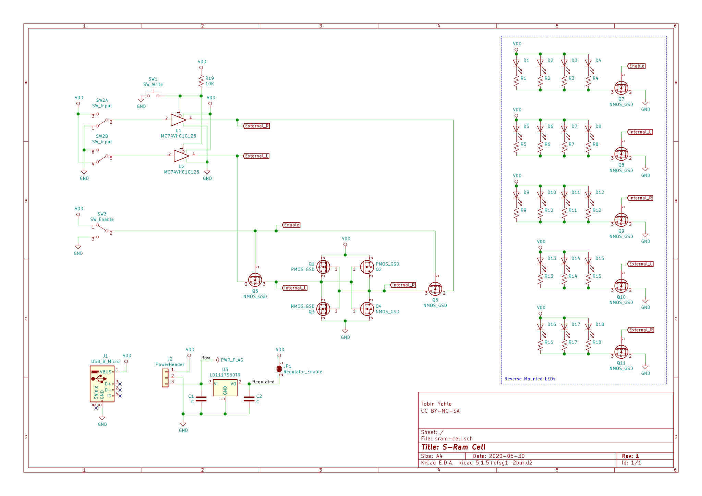

# S-RAM Cell

This board contains a single S-RAM cell implemented with two CMOS inverters feeding into eachother.

## Schematic 

# License

This work is licensed under a [Creative Commons Attribution-NonCommercial-ShareAlike 4.0 International License](http://creativecommons.org/licenses/by-nc-sa/4.0/).
